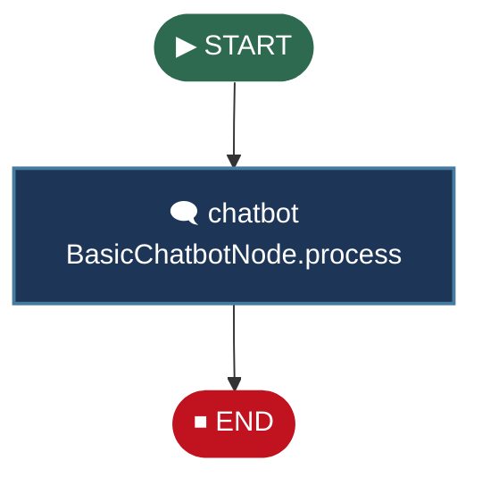
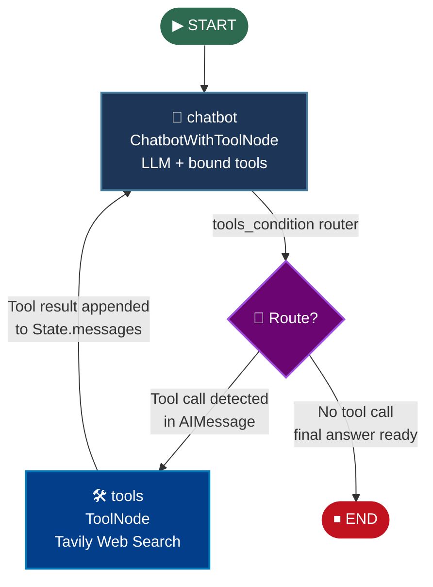
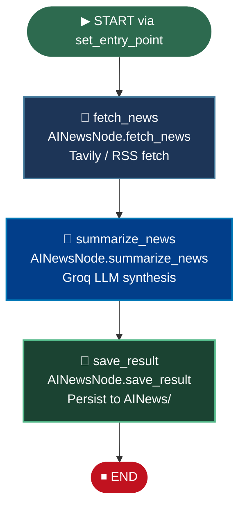

<div align="center">

# 🤖 LangGraph Agentic AI Chatbot

**A modular, multi-mode agentic AI system built on LangGraph — capable of pure conversation, real-time web search, and autonomous AI news intelligence.**

[](https://python.org)
[](https://github.com/langchain-ai/langgraph)
[](https://langchain.com)
[](https://groq.com)
[](https://streamlit.io)

</div>

---

## 🌟 Vision & Value Proposition

Most AI chatbot demos are stateless wrappers around a single LLM call. **This project is different.**

`LangGraph Agentic AI Chatbot` is a **graph-native, stateful AI system** that routes user intent across three distinct execution pipelines — a lightweight conversational agent, a ReAct-style tool-using agent with live web search, and a fully autonomous multi-node AI news pipeline that fetches, summarizes, and persists intelligence reports.

Built on LangGraph's first-class `StateGraph` abstraction, the system demonstrates production-grade patterns: conditional edge routing, prebuilt tool nodes, state-passing across agent hops, and a clean separation between graph construction logic and UI.

> **This is not a chatbot. It's a graph-orchestrated agentic runtime with a chatbot interface.**

---

## ✨ Key Features

| Feature | Description |
|---|---|
| 🗺️ **Graph-Native Architecture** | Every use case is a compiled `StateGraph` — not a chain, not a simple prompt loop |
| 🔀 **Dynamic Mode Switching** | Three fully independent graph topologies selectable at runtime via Streamlit UI |
| 🛠️ **ReAct Tool Loop** | The tool-use agent autonomously decides when to invoke Tavily web search and loops back until the task is complete |
| 📰 **Autonomous News Pipeline** | A sequential 3-node graph independently fetches AI news, summarizes it with an LLM, and saves the result — zero human in the loop |
| ⚡ **Groq-Accelerated Inference** | Powered by Groq's ultra-low-latency LPU inference for near-instant LLM responses |
| 🧩 **Modular Node Design** | Each node (`BasicChatbotNode`, `ChatbotWithToolNode`, `AINewsNode`) is an isolated, testable Python class |
| 🔌 **Multi-LLM Ready** | Architecture supports both `langchain_groq` and `langchain_openai` — swap models without changing graph logic |
| 🗃️ **FAISS Vector Store Ready** | `faiss-cpu` included for RAG extensions and semantic search augmentation |

---

## 🏗️ System Architecture

### State Definition

All nodes in this system communicate through a shared `State` object — the single source of truth for the entire graph execution. Built on LangChain's `MessagesState` pattern, it carries the full conversation history as a list of `BaseMessage` objects, enabling every node to read prior context and append new messages atomically.

```python
# src/langgraphAgenticAI/state/state.py
from langgraph.graph import MessagesState

class State(MessagesState):
    # Inherits: messages: Annotated[list[BaseMessage], add_messages]
    # Add custom fields here as the graph grows:
    # summary: str
    # retrieved_docs: list[str]
    pass
```

The `add_messages` reducer ensures messages are **appended**, not overwritten, on each graph step — preserving full multi-turn history across all nodes automatically.

---

### Node Logic

The `GraphBuilder` class acts as the **factory** for all graph topologies. It wires nodes, edges, and conditional routing in three distinct configurations:

#### 1. `basic_chatbot_build_graph()` — Linear Conversation

A minimal two-edge graph. `START → chatbot → END`. The `BasicChatbotNode` processes the current state's messages and returns a new AI message. No tool calls, no loops. Ideal for pure LLM conversation.

#### 2. `chatbot_with_tools_build_graph()` — ReAct Agent Loop

The core agentic pattern. The chatbot node is bound with tools; if the LLM decides a tool call is needed, the prebuilt `tools_condition` router fires, redirecting execution to the `ToolNode`. The tool result is appended to state and control returns to the chatbot — creating a **self-correcting reasoning loop** that terminates only when the LLM returns a final answer.

#### 3. `ai_news_build_graph()` — Autonomous Pipeline

A linear 3-node DAG with no human interaction. The graph autonomously: fetches live AI news → passes results to an LLM summarizer → writes the final report to disk. This pattern demonstrates LangGraph as an **agentic batch processor**, not just a chatbot engine.

---

## 📊 Interactive Graph Flowcharts

### Mode 1: Basic Chatbot



---

### Mode 2: Chatbot with Tools (ReAct Loop)



> **How the router works:** `tools_condition` is a LangGraph prebuilt function. It inspects the last message in `State.messages`. If it's an `AIMessage` with a `tool_calls` attribute populated, it routes to `"tools"`. Otherwise, it routes to `END`. This single conditional edge powers the entire ReAct reasoning cycle.

---

### Mode 3: AI News Autonomous Pipeline



---

## 📁 Project Structure

```
Agentic-Chatbot/
│
├── app.py                          # Entry point — launches Streamlit UI
├── requirements.txt                # Python dependencies
├── pyproject.toml                  # Project metadata
│
├── AINews/                         # Output directory for saved news reports
│
└── src/
    └── langgraphAgenticAI/
        ├── main.py                 # load_langgraph_agenticai_app()
        │
        ├── state/
        │   └── state.py            # Shared State definition (MessagesState)
        │
        ├── graph/
        │   └── graph.py            # GraphBuilder — all graph topologies
        │
        ├── nodes/
        │   ├── basic_chatbot_node.py       # BasicChatbotNode
        │   ├── chatbot_with_Tool_node.py   # ChatbotWithToolNode (ReAct)
        │   └── ai_news_node.py             # AINewsNode (fetch/summarize/save)
        │
        └── tools/
            └── search_tool.py      # Tavily tool factory & ToolNode builder
```

---

## 🚀 Installation & Setup

### Prerequisites

- Python **3.11+**
- A [Groq API Key](https://console.groq.com/) (free tier available)
- A [Tavily API Key](https://tavily.com/) (for web search & news modes)

### 1. Clone the Repository

```bash
git clone https://github.com/Vidit-lab/Agentic-Chatbot.git
cd Agentic-Chatbot
```

### 2. Create a Virtual Environment

```bash
# Using venv
python -m venv .venv
source .venv/bin/activate        # Linux / macOS
.venv\Scripts\activate           # Windows

# OR using uv (recommended — lockfile already included)
pip install uv
uv sync
```

### 3. Install Dependencies

```bash
pip install -r requirements.txt
```

### 4. Configure Environment Variables

Create a `.env` file in the project root:

```env
GROQ_API_KEY=your_groq_api_key_here
TAVILY_API_KEY=your_tavily_api_key_here

# Optional — for OpenAI model support
OPENAI_API_KEY=your_openai_api_key_here
```

---

## ▶️ Running the Application

```bash
streamlit run app.py
```

The Streamlit UI will open at `http://localhost:8501`. Use the sidebar to:

1. **Select your LLM model** (Groq / OpenAI)
2. **Choose a use case** — `Basic Chatbot`, `Chatbot with Tool`, or `AI News`
3. Start chatting — the corresponding graph is compiled on-demand

---

## 🧪 Use Case Walkthrough

### Basic Chatbot
```
You: Explain the transformer architecture in simple terms.
Bot: [Pure LLM response — no tools invoked]
```

### Chatbot with Tool (ReAct)
```
You: What are the latest LLM releases this week?
Bot: [Invokes Tavily web search → reads results → synthesizes answer]
```

### AI News Pipeline
```
# Triggered from UI — runs fully autonomously
Graph: fetch_news → summarize_news → save_result
Output: Saved to AINews/report_<timestamp>.txt
```

---

## 🛠️ Tech Stack

| Layer | Technology |
|---|---|
| **Graph Orchestration** | [LangGraph](https://github.com/langchain-ai/langgraph) |
| **LLM Framework** | [LangChain](https://langchain.com) |
| **LLM Inference** | [Groq](https://groq.com) (LLaMA 3, Mixtral) · OpenAI |
| **Web Search Tool** | [Tavily](https://tavily.com) via `tavily-python` |
| **Vector Store** | [FAISS](https://github.com/facebookresearch/faiss) (`faiss-cpu`) |
| **UI** | [Streamlit](https://streamlit.io) |
| **Package Management** | `pip` · `uv` |

---

## 🔭 Roadmap

- [ ] **Memory / Checkpointing** — Persist conversation state across sessions using LangGraph's `SqliteSaver` or `PostgresSaver`
- [ ] **Human-in-the-Loop** — Add `interrupt_before` breakpoints for approval workflows
- [ ] **RAG Mode** — Wire FAISS vector store into a new graph topology for document Q&A
- [ ] **Multi-Agent** — Supervisor agent that delegates to specialized sub-agents
- [ ] **LangSmith Tracing** — Full observability for all graph executions
- [ ] **Docker** — Containerized deployment with `docker-compose`

---

## 🤝 Contributing

Contributions are welcome! Please open an issue first to discuss what you'd like to change, then submit a pull request.

1. Fork the repository
2. Create your feature branch: `git checkout -b feature/your-feature`
3. Commit your changes: `git commit -m 'feat: add your feature'`
4. Push to the branch: `git push origin feature/your-feature`
5. Open a Pull Request

---

**Built with ❤️ using LangGraph · LangChain · Groq**

If you find this project useful, please consider giving it a ⭐

</div>
